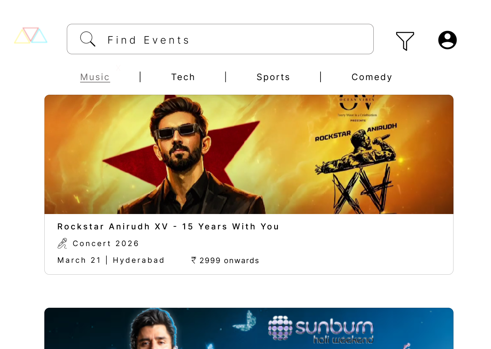
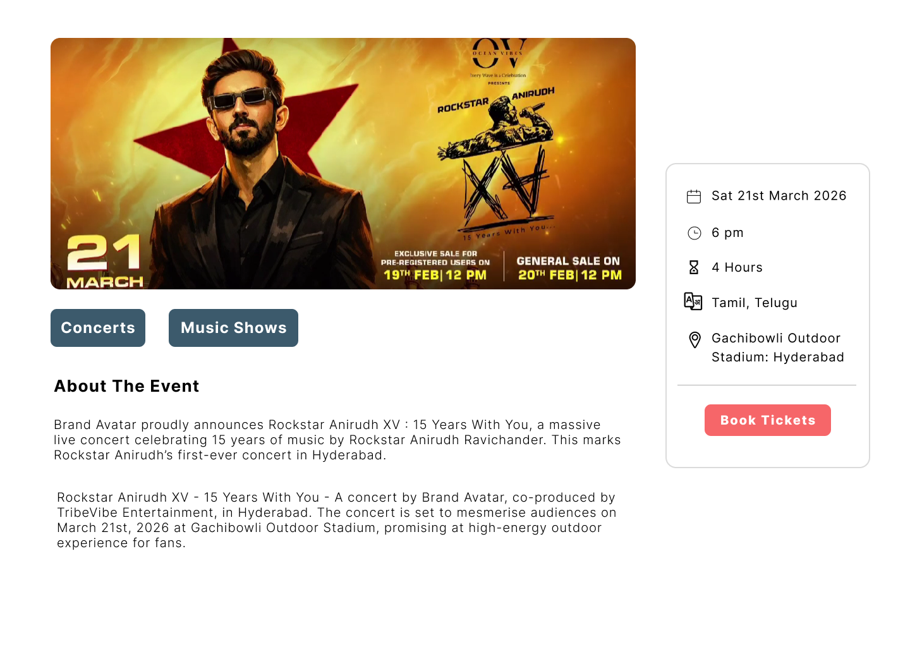
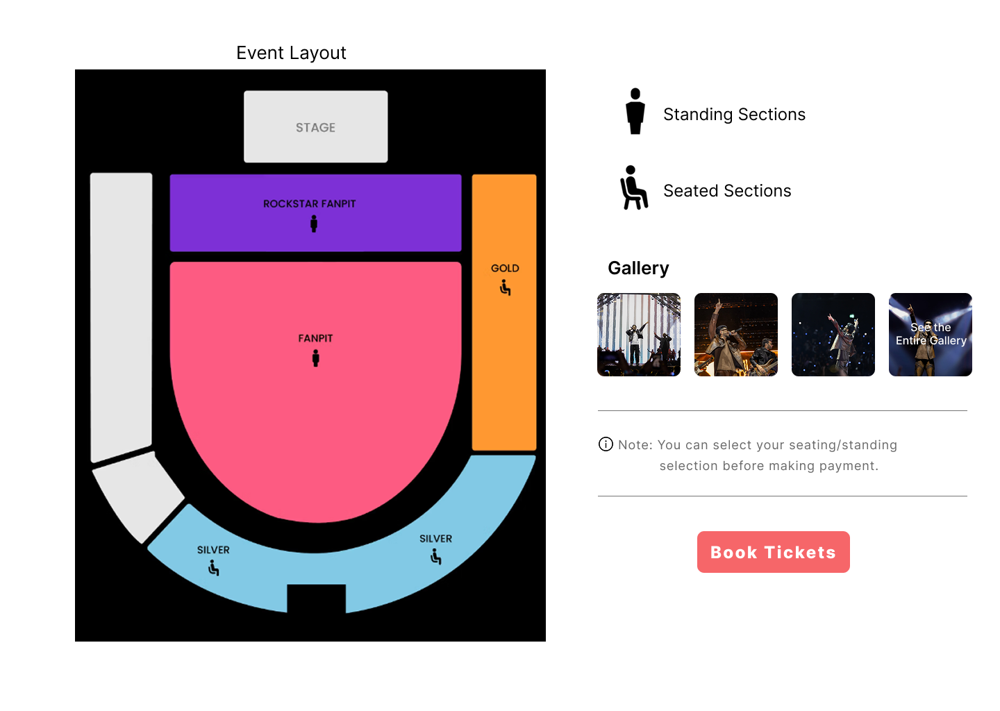
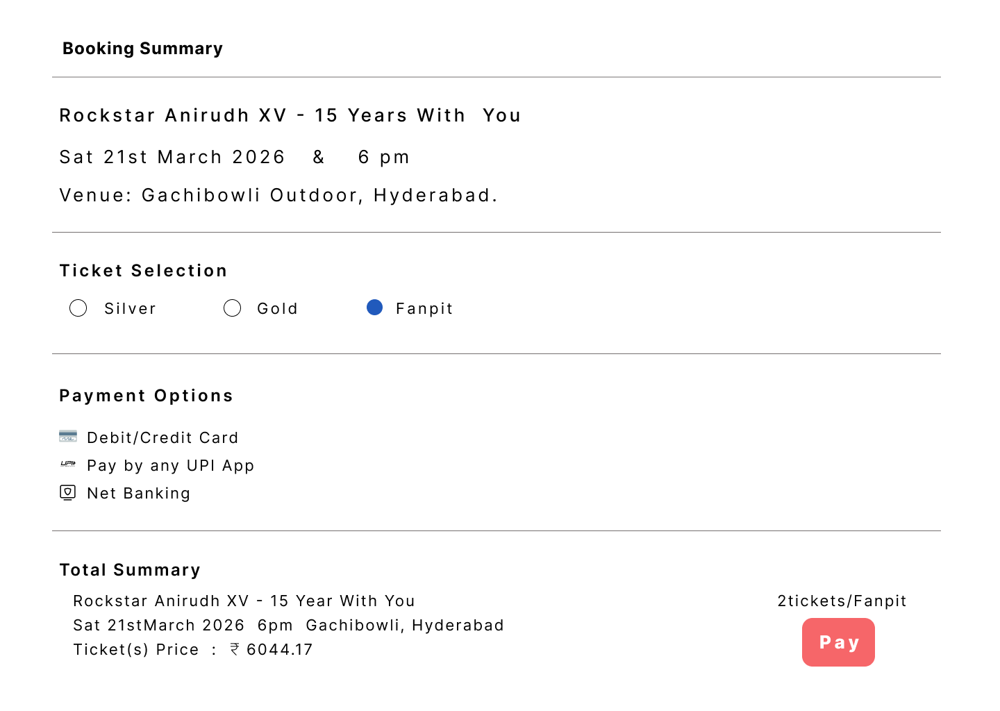
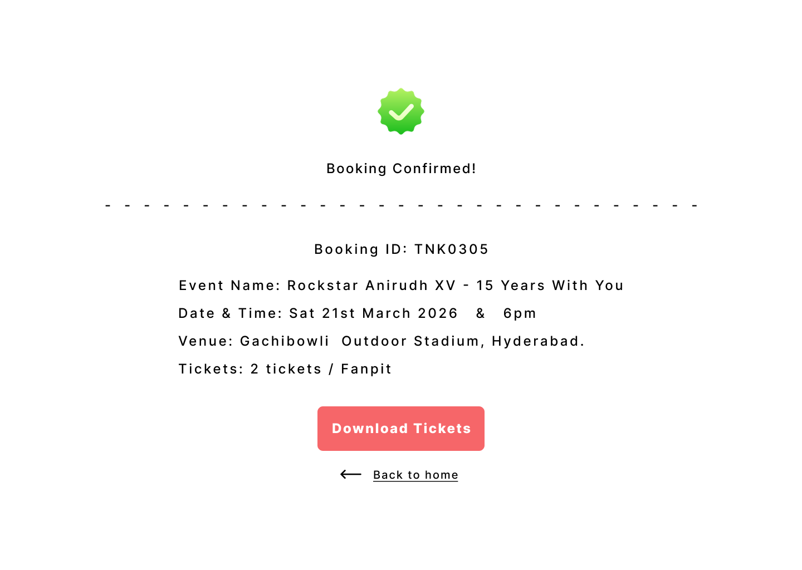
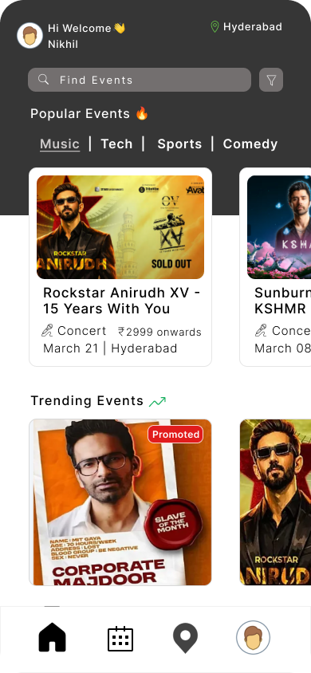
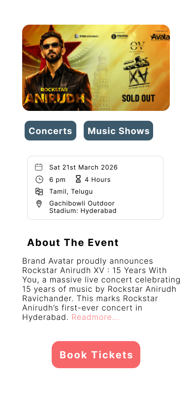
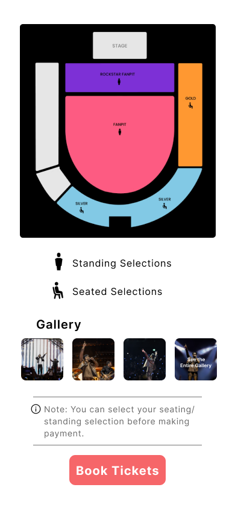
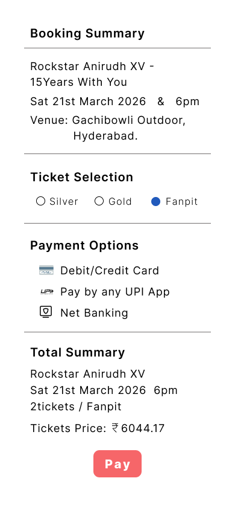
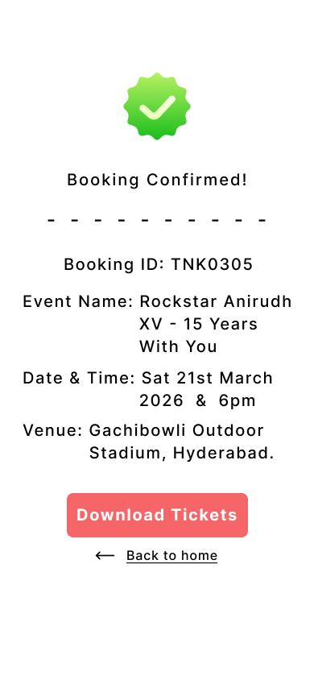

# Event Booking System – UI/UX Design

This repository contains the UI/UX design for an Event Booking System created as part of an internship assignment.

## Project Overview
The goal of this project is to design a complete event booking experience where users can:
- Browse events
- View event details
- Select seats
- Complete booking
- Receive confirmation

The design focuses on clarity, usability, and cross-platform consistency.

## Platforms Designed
- Web (Desktop)
- Mobile

## Screens Designed

## Screenshots

### Web – Home

### Web – Event Detail

### Web – Seat Selection

### Web – Payment

### Web – Confirmation

### Mobile – Home

### Mobile – Event Detail

### Mobile – Seat Selection

### Mobile – Payment 

### Mobile – Confirmation

## User Flow
Home → Event Detail → Seat Selection → Checkout → Confirmation

## Tools Used
- Figma

## Figma Prototype Link
https://www.figma.com/proto/9E8Sc1hsvjrlRMlVn2TkIY/event-booking?node-id=0-1&t=UatUVmVAC17LRIlI-1
